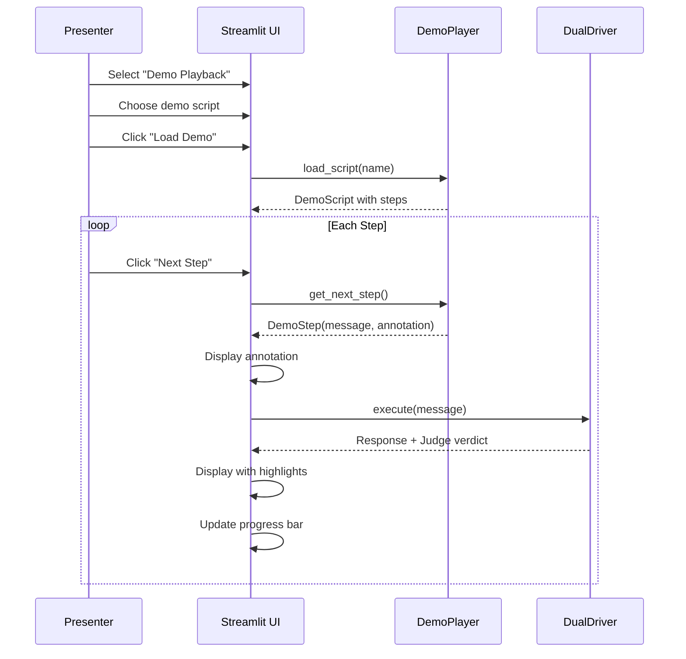

# ✅ Demo Playback Integration Complete

Demo playback mode is now integrated into the UI.

## What Was Integrated

### Core Files
- ✅ [app.py](app.py) - Added "Demo Playback" mode with full UI
- ✅ [demo_player.py](demo_player.py) - Demo script engine (185 lines)
- ✅ [demos/README.md](demos/README.md) - Usage guide
- ✅ [demos/quick-wins.md](demos/quick-wins.md) - Detailed script with talking points

### Documentation
- ✅ [README.md](README.md) - Updated features section
- ✅ [DEMO_QUICKSTART.md](DEMO_QUICKSTART.md) - Quick start guide
- ✅ [DEMO_PLAYBACK_INTEGRATION.md](DEMO_PLAYBACK_INTEGRATION.md) - Integration reference
- ✅ [README_DEMO_PLAYBACK.md](README_DEMO_PLAYBACK.md) - Feature overview

## Changes to app.py

### 1. Imports (line 15)
```python
from demo_player import DemoPlayer, get_available_demos
```

### 2. Mode Selector (line 43)
```python
mode = st.radio("Mode", ["User-Driven", "Demo Playback", "Simulated"])
```

### 3. Demo Playback Handler (lines 299-398)
- Demo script selector dropdown
- Load Demo button
- Next Step button with progress
- Annotation display (guides presenter)
- Automatic step execution
- Integration with driver/judge/highlighting

## 4 Built-in Demos

| Demo | Duration | Persona | Best For |
|------|----------|---------|----------|
| quick-wins | 5 min | Data Scientist | First-time viewers |
| roi-showcase | 7 min | Data Scientist | Stakeholders |
| sre-workflow | 6 min | SRE On-call | Technical teams |
| developer-onboarding | 8 min | Full-stack Dev | Dev teams |

## How It Works



## Testing

### Verify Imports
```bash
python3 -c "from demo_player import DemoPlayer, get_available_demos; print(list(get_available_demos().keys()))"
```

Expected output:
```
['quick-wins', 'roi-showcase', 'sre-workflow', 'developer-onboarding']
```

### Run the App
```bash
# Set API key first
export OPENAI_API_KEY="sk-..."

# Launch
streamlit run app.py
```

Then:
1. Click "Demo Playback" in sidebar
2. Select "quick-wins" from dropdown
3. Click "📜 Load Demo"
4. Click "▶️ Next Step" repeatedly
5. Watch annotations guide you

## Features

✅ **Step-by-step playback** - Controlled pacing  
✅ **Annotations** - Built-in presenter notes  
✅ **Progress tracking** - Visual progress bar  
✅ **Highlight guidance** - Tells you what metrics to watch  
✅ **Auto-configuration** - Personas loaded automatically  
✅ **Reproducible** - Same script, consistent results  

## Demo Script Format

Each script includes:
```python
DemoScript(
    name="Demo Name",
    description="What it shows",
    persona="data-scientist",      # Auto-loads persona
    memory_backend="dict",
    enable_judge=True,              # Auto-enables judge
    steps=[
        DemoStep(
            user_message="Question",
            annotation="🎯 What to point out",
            wait_seconds=6.0,       # For future auto-play
            highlight_metrics=["highlights", "tokens"]
        ),
    ]
)
```

## Presenter Workflow

1. **Before presenting:**
   - Set API key
   - Launch app
   - Select demo mode
   - Choose script

2. **During presentation:**
   - Click "Next Step"
   - Read annotation aloud
   - Point at highlights/scores
   - Wait for questions
   - Advance to next step

3. **After demo:**
   - Switch to User-Driven mode
   - Take live questions
   - Show memory inspector
   - Export memories

## Creating Custom Demos

Edit `demo_player.py`:

```python
DEMO_SCRIPTS = {
    # ... existing demos ...
    
    "my-demo": DemoScript(
        name="My Custom Demo",
        description="What it demonstrates",
        persona="data-scientist",
        memory_backend="dict",
        enable_judge=True,
        steps=[
            DemoStep(
                user_message="Your question",
                annotation="💡 What to point out",
                wait_seconds=7.0,
                highlight_metrics=["scores"]
            ),
        ]
    ),
}
```

See [demos/README.md](demos/README.md) for detailed guide.

## Use Cases

### Sales Demos
- Hands-free presentation
- Consistent messaging
- Professional polish
- Reproducible results

### Screenshots/Video
- Consistent demos for docs
- Tutorial recordings
- Before/after captures
- Marketing materials

### Testing
- Regression testing
- Quality benchmarks
- Backend comparisons
- Performance validation

### Training
- Onboarding new users
- Learning the tool
- Understanding memory value
- Best practices demo

## Status

**✅ READY TO USE**

All integration complete. Run `streamlit run app.py` and select "Demo Playback" mode.

## Next Steps

1. **Test it** - Run a demo end-to-end
2. **Customize** - Create your own demo script
3. **Present** - Use in sales/demos
4. **Iterate** - Add more demos as needed

## Future Enhancements

- [ ] Auto-play mode (hands-free playback)
- [ ] Demo recording (save/replay sessions)
- [ ] Branching scenarios (A/B paths)
- [ ] Export as video
- [ ] Custom timing per step
- [ ] Remote control (presenter view)
